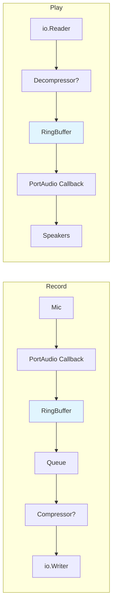

# 🎵 Go-audio

<p align="center">
  <a href="https://go.dev"></a>
  
  
  
  <a href="https://opensource.org/licenses/MIT"></a>
</p>

**Go-audio** is a lightweight, high-performance audio streaming library for Go. Built for real-time recording and playback, it uses a lock-free ring buffer and optional dual-stage compression (Opus + Zstd) to deliver low-latency audio processing with minimal memory overhead.

Designed as a pure library — no hard logging dependencies, no hidden allocations, just clean audio I/O you can embed anywhere.

## ✨ Key Features

  * **Lock-Free Ring Buffer**: Custom atomic ring buffer with exponential spinning backoff (`runtime.Gosched` -> `time.Sleep`) for zero-mutex communication between PortAudio callbacks and processing goroutines.
  * **Real-Time Streaming**: Record and playback raw PCM (`float32`) or compressed audio with predictable latency via configurable `FramesPerBuffer`.
  * **Optional Dual Compression**: Chain Opus (lossy audio codec) + Zstandard (lossless compressor) for efficient storage/transmission — or bypass entirely for raw mode.
  * **Zero-Copy I/O**: Uses `unsafe.Slice` for direct `[]float32` <-> `[]byte` conversion, eliminating intermediate allocations in the hot path.
  * **Logger-Agnostic**: No forced dependency on `zap`, `slog`, or `fmt.Println`. Provide an optional `func(string)` callback for diagnostics, or run silently.
  * **Linux Audio Routing**: Built-in `AutoRouteMonitor` for PulseAudio/PipeWire to redirect input sources to output monitors (system audio capture).
  * **Thread-Safe Primitives**: `Queue` and `RingBuffer` with atomic `Close`/`IsClosed` flags for graceful shutdown without race conditions.

## 📦 Installation

```bash
go get github.com/Votline/Go-audio
```

### Dependencies

  * `github.com/gordonklaus/portaudio` - Cross-platform audio I/O
  * `github.com/hraban/opus` - Opus audio codec (optional)
  * `github.com/klauspost/compress/zstd` - Zstandard compression (optional)

> 💡 Opus and Zstd are only required if `useCompressor=true`. Raw mode works without them.

## 🚀 Quick Start

### Record audio to file

```go
package main

import (
    "os"
    "github.com/Votline/Go-audio"
)

func main() {
    // Initialize audio client with compression enabled
    // All zero values = use sensible defaults
    acl, err := goaudio.InitAudioClient(
        0, 0, 0, 0,        // bufSize, queueSize, readSize, cmprSize (0 = default)
        0, 0, 0, 0,        // channels, bitrate, sampleRate, duration (0 = default)
        true,              // useCompressor: Opus + Zstd
        nil,               // logFunc: nil = silent
    )
    if err != nil {
        panic(err)
    }

    file, err := os.Create("recording.aud")
    if err != nil {
        panic(err)
    }
    defer file.Close()

    // Start blocking recording loop
    go func() {
        if err := acl.Record(file); err != nil {
            panic(err)
        }
    }()

    // Record for 10 seconds, then stop
    time.Sleep(10 * time.Second)
    acl.StopRecording()
}
```

### Playback recorded audio

```go
file, err := os.Open("recording.aud")
if err != nil {
    panic(err)
}
defer file.Close()

// Blocking playback loop
if err := acl.Play(file); err != nil {
    panic(err)
}
```

## 🧠 Advanced Usage

### Raw Mode (No Compression)

Skip Opus/Zstd for minimal CPU usage and bit-perfect PCM passthrough:

```go
acl, err := goaudio.InitAudioClient(
    0, 0, 0, 0, 0, 0, 0, 0,
    false, // useCompressor = false -> raw float32 PCM
    nil,
)
```

Packet format in raw mode:
  * `uint32` little-endian: payload size in **bytes**
  * Payload: raw `float32` samples (4 bytes each, little-endian)

### Custom Logging Hook

Inject your own logger without modifying the library:

```go
logFunc := func(msg string) {
    myLogger.Info(msg) // your logger here
}

acl, err := goaudio.InitAudioClient(0, 0, 0, 0, 0, 0, 0, 0, true, logFunc)
```

## 🏗 Architecture

Go-audio separates concerns into independent, concurrent components:



> 🔵 **RingBuffer** is the only shared-memory primitive — lock-free, atomic, and designed for real-time safety.

## 📖 API Reference

### Package `goaudio` (Facade)

  * **`InitAudioClient(bufSize, queueSize, readSize, cmprSize, channels, bitrate, sampleRate, duration int, useCompressor bool, logFunc func(string)) (*audio.AudioClient, error)`**  
    Unified constructor. Zero values use sensible defaults. Returns the core `AudioClient`.

  * **`InitCompressor(bitrate, channels, sampleRate, duration int, encBuf []byte, decBuf []int16) (*compressor.Compressor, error)`**  
    Low-level compressor init. Zero values use sensible defaults.

  * **`NewRingBuffer(bufSize uint64) *ringbuffer.RingBuffer`**  
    Create a lock-free ring buffer for custom use.

  * **`NewQueue(bufLen int) *queue.Queue`**  
    Create a slice-backed FIFO queue for audio chunks.

### Core `AudioClient` Methods

  * **`Record(w io.Writer) error`**  
    Start blocking recording loop. Writes compressed/raw packets with `uint32` size prefix. Call `StopRecording()` to exit.

  * **`Play(r io.Reader) error`**  
    Start blocking playback loop. Reads packets in the same format as `Record`. Call `StopPlay()` to exit.

  * **`StopRecording() / IsRecording() bool`**  
    Signal and check recording state.

  * **`StopPlay() / IsPlaying() bool`**  
    Signal and check playback state.


## ⚙️ Configuration Defaults

| Parameter | Default | Description |
|-----------|---------|-------------|
| `channels` | 2 | Stereo audio |
| `sampleRate` | 48000 Hz | CD-quality sampling |
| `duration` | 20 ms | Frame duration (affects latency) |
| `bitrate` | 48000 bps | Opus target bitrate |
| `bufSize` | 7680 | Ring buffer capacity (samples) |
| `queueSize` | 7680 | Queue initial capacity (samples) |
| `readSize` | 3840 | Chunk size for queue operations |

> 💡 Lower `duration` = lower latency, but higher CPU overhead. 20ms is a good balance for most use cases.

## 🐧 Linux Notes

  * Requires `libportaudio2` and development headers:  
    ```bash
    sudo apt install portaudio19-dev  # Debian/Ubuntu
    ```
  * `AutoRouteMonitor` requires `pactl` (PulseAudio utils) or PipeWire with PulseAudio compatibility layer.
  * For system audio capture, ensure your user is in the `audio` group and PulseAudio is running.

## 📜 License

  - **License:** This project is licensed under [MIT](LICENSE)
  - **Third-party Licenses:** Third-party [licenses/](licenses/).


